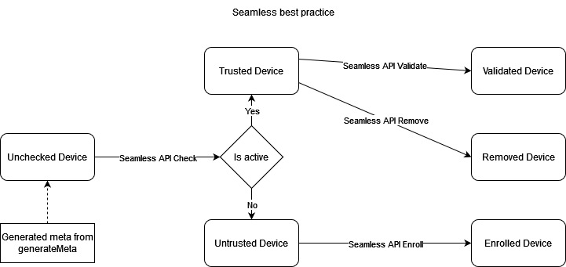

# android-trusted-device-v2

Visit [official website](https://fazpass.com) for more information about the product and see documentation at [online documentation](https://doc.fazpass.com) for more technical details.

## Android OS

Minimum: Android 24
Maximum: Android 34

## Installation

### 1. Add Jitpack auth token in your gradle properties (*project*/gradle.properties)

```properties
# Project-wide Gradle settings.
# ...

# Add this at the bottom
fazpassAuthToken={{AUTH_TOKEN}}
```

### 2. Add Jitpack repo in your gradle repositories

If your gradle use buildscript syntax, add Jitpack repo in your root-level build.gradle (*project*/build.gradle):
```gradle
buildscript {
	//...
}

allprojects {
	repositories {
		// Another repo...

	        maven { 
	            url 'https://jitpack.io'
	            credentials { username fazpassAuthToken }
	        }
	}
}
```
If your gradle use plugin syntax, add Jitpack repo in your settings.gradle (*project*/settings.gradle):
```gradle
pluginManagement {
    repositories {
        // Another repo...
    }
}

dependencyResolutionManagement {
    repositoriesMode.set(RepositoriesMode.FAIL_ON_PROJECT_REPOS)
    repositories {
        // Another repo...

        maven { 
            url 'https://jitpack.io'
            credentials { username fazpassAuthToken }
        }
    }
}
```

### 3. Add the dependency in your app-level build.gradle (*project*/app/build.gradle)

```gradle
dependencies {
	// Another dependencies...
	implementation 'com.github.fazpass-sdk:android-trusted-device-v2:Tag'
}
```

#### Version tag

| Version | Tag | Date 		                                                                  |
| -- | --	 			|--------------------------------------------------------------------------|
| 1.0 (Latest)  | americanbobtail-v1  	| Aug 30   |                                     | 

### 4. Sync project with gradle files

## Getting Started

Before using this SDK, make sure to get the public key from Fazpass Dashboard's merchant app.
Then, put the public key into the assets folder.

1. Open your android root project, then go to app/src/main/assets/ (if assets folder doesn't exist, create a new one)
2. Put the public key in this folder

### Retrieving your application signatures

When creating a new merchant app in Fazpass Dashboard, there is a "signature" input.


Here's how to get this signature:

Put this line of code in your main activity
```kotlin
// get fazpass instance
val fazpass = FazpassFactory.getInstance()

Log.i("APPSGN", fazpass.getAppSignatures(this).toString())
```
Then build apk for release. Launch it while your device is still connected and debugging in your pc.
Open logcat and query for `APPSGN`. It's value is an array. it will looks like this: `[Gw+6AWbS7l7JQ7Umb1zcs1aNA8M=]`.
If there is more than one signature, pick the very first one. Copy the signature `Gw+6AWbS7l7JQ7Umb1zcs1aNA8M=` and fill the signature 
of your merchant app with this value.

After you uploaded your apk or abb into the playstore, download your app from the playstore then check your app's signatures again.
If it's different, make sure to update the signature value of your merchant app.

## Usage

This package main purpose is to generate meta which you can use to communicate with Fazpass rest API. But
before calling generate meta method, you have to initialize it first by calling this method:
```kotlin
// get fazpass instance
val fazpass = FazpassFactory.getInstance()

fazpass.init(this, "YOUR_PUBLIC_KEY_ASSET_NAME")
```

Call `generateMeta()` method to automatically launch local authentication (biometric / password) and meta will be generated if authentication is success. 
Otherwise `BiometricAuthError` exception will occurs.

> You have to call generate meta method using FragmentActivity OR AppCompatActivity as context. Otherwise your app might crash.

```kotlin
import androidx.fragment.app.FragmentActivity
// OR import androidx.appcompat.app.AppCompatActivity

class Activity : FragmentActivity() {
// OR class Activity : AppCompatActivity() {

	// your activity fields & methods...

	fun generateMeta() {
		fazpass.generateMeta(this@Activity) { meta, exception ->
		    when (exception) {
		        is BiometricAuthError -> TODO()
		        is BiometricUnavailableError -> TODO()
		        is BiometricNoneEnrolledError -> TODO()
		        is BiometricSecurityUpdateRequiredError -> TODO()
		        is BiometricUnsupportedError -> TODO()
		        is EncryptionException -> TODO()
		        is PublicKeyNotExistException -> TODO()
		        is UninitializedException -> TODO()
		        null -> { 
		            print(meta) 
		        }
		    }
		}
	}
}
```

### Seamless Best Practice



Everytime you want to check your device by hitting Seamless API Check, you should generate a new meta from `generateMeta()` method to ensure your seamless status is up-to-date with your device current state. After a flow is finished, you have to start from the beginning to do another operation. Meta should not be saved into any persistent storage (shared preferences, local storage, database, etc.). But, generating meta too many times might leads to a bad user experience, since they have to do biometric authentication everytime meta is about to be generated. You should only check your device when you are about to do sensitive action (Login, Payment, etc.). For example, if you have an online store app, instead of checking your device for every item you add into your cart, it is better to just check your device when you are about to pay for everything in your cart.

## Exceptions

#### UninitializedException

Produced when fazpass init method hasn't been called once.

#### PublicKeyNotExistException

Produced when public key with the name registered in init method doesn't exist in the assets directory.

#### EncryptionException

Produced when encryption went wrong because you used the wrong public key.

#### BiometricAuthError

Produced when biometric authentication is finished with an error. (example: User cancelled biometric auth, User failed biometric auth too many times, and many more).

#### BiometricUnavailableError

Produced when android can't start biometric authentication because there is no suitable hardware (e.g. no biometric sensor or no keyguard) or the hardware is unavailable.

#### BiometricNoneEnrolledError

Produced when android can't start biometric authentication because there is no biometric (e.g. Fingerprint, Face, Iris) or device credential (e.g. PIN, Password, Pattern) enrolled.

#### BiometricSecurityUpdateRequiredError

Produced when android can't start biometric authentication because a security vulnerability has been discovered with one or
more hardware sensors. The affected sensor(s) are unavailable until a security update has addressed the issue.

#### BiometricUnsupportedError

Produced when android can't start biometric authentication because the specified options are incompatible with the current Android version.

## Set preferences for data collection

This package supports application with multiple accounts, and each account can have different settings for generating meta.
To set preferences for data collection, call `setSettings()` method.

```kotlin
// index of an account
val accountIndex = 0

// create preferences
val settings = FazpassSettings.Builder()
  .enableSelectedSensitiveData(SensitiveData.location)
  .setBiometricLevelToHigh()
  .build()

// save preferences
fazpass.setSettings(accountIndex, settings)

// apply saved preferences by using the same account index
val meta = fazpass.generateMeta(this, accountIndex) { meta, exception -> 
    print(meta)
}

// delete saved preferences
fazpass.setSettings(accountIndex, null)
```

`generateMeta()` accountIndex parameter has -1 as it's default value.

> We strongly advised against saving preferences into default account index. If your application
> only allows one active account, use 0 instead.

## Data Collection

Data collected and stored in generated meta. Based on how data is collected, data type is divided into three:
General data, Sensitive data and Other.
General data is always collected while Sensitive data requires more complicated procedures before they can be collected.
Other is a special case. They collect a complicated test result, and might change how `generateMeta()` method works.

To enable Sensitive data collection, you need to set preferences for them and
specifies which sensitive data you want to collect.
```kotlin
val builder = FazpassSettings.Builder()
    .enableSelectedSensitiveData(
      SensitiveData.location,
      SensitiveData.simNumbersAndOperators,
      SensitiveData.vpn
)
```
Then, you have to follow the procedure on how to enable each of them as described in their own segment down below.

For others, you also need to set preferences for them and specifies which you want to enable.
```kotlin
val builder = FazpassSettings.Builder()
    .setBiometricLevelToHigh()
```
For detail, read their description in their own segment down below.

### General data collected

* Your device platform name (Value will always be "android").
* Your app package name.
* Your app debug status.
* Your device rooted status.
* Your device emulator status.
* Your app cloned status.
* Your device mirroring or projecting status.
* Your app signatures.
* Your device information (Android version, phone brand, phone type, phone cpu).
* Your network IP Address and vpn status.

### Sensitive data collected

#### Your device location and mock location status

Required Permissions:
* android.permission.ACCESS_COARSE_LOCATION or android.permission.ACCESS_FINE_LOCATION
* android.permission.FOREGROUND_SERVICE

After you enabled location data collection and user has granted the location permission, you have to
make sure the user has enabled their location/gps settings before you call generateMeta() method.

#### Your device SIM numbers and operators (if available)

Required Permissions:
* android.permission.READ_PHONE_NUMBERS
* android.permission.READ_PHONE_STATE

### Other data collected

#### High-level biometric

Enabling high-level biometrics makes the local authentication in `generateMeta()` method use ONLY biometrics,
preventing user to use password as another option. After enabling this for the first time, immediately call `generateNewSecretKey()`
method to create a secret key that will be stored safely in device keystore provider. From now on, calling `generateMeta()`
with High-level biometric preferences will conduct an encryption & decryption test using the newly created secret key.
whenever the test is failed, it means the secret key has been invalidated because one these occurred:
- Device has enrolled another biometric information (new fingerprints, face, or iris)
- Device has cleared all biometric information
- Device removed their device passcode (password, pin, pattern, etc.)

When secret key has been invalidated, trying to hit Fazpass Check API will fail. The recommended action for this is
to sign out every account that has enabled high-level biometric and make them sign in again with low-level biometric settings.
If you want to re-enable high-level biometrics after the secret key has been invalidated, make sure to
call `generateNewSecretKey()` once again.

Usage:

```kotlin
try {
    fazpass.generateNewSecretKey(this)
} catch (e: java.security.InvalidAlgorithmParameterException) {
    // Thrown when no biometric is enrolled in the device
}
```

## Handle incoming Cross Device Notification

First, if your app targets android Tiramisu (Api level 33) or higher, you have to request runtime permission for notification.

```kotlin
if (Build.VERSION.SDK_INT >= Build.VERSION_CODES.TIRAMISU) {
    val permission = Manifest.permission.POST_NOTIFICATIONS
    val permissionStatus = ContextCompat.checkSelfPermission(this, permission)
    if (permissionStatus != PackageManager.PERMISSION_GRANTED) {
        ActivityCompat.requestPermissions(this, arrayOf(permission), 1)
    }
}
```

When application is in background state (not running), incoming cross device notification will enter your system notification tray
and shows them as a notification. Pressing said notification will launch the application with cross device data as an argument.
When application is in foreground state (currently running), incoming cross device notification will immediately sent into the application
without showing any notification.

To retrieve cross device notification data when app is in background state, you have to call `getCrossDeviceDataFromNotification()` method.
```kotlin
// IMPORTANT: Make sure you filled the parameter with the first activity's intent since app launch
val data = fazpass.getCrossDeviceDataFromNotification(this@MainActivity.intent)
```

To retrieve cross device notification data when app is in foreground state, you have to get the stream instance by calling
`getCrossDeviceDataStreamInstance()` then start listening to the stream.
```kotlin
// get the stream instance
val crossDeviceStream = fazpass.getCrossDeviceDataStreamInstance(this)

// start listening to the stream
crossDeviceStream.listen { data ->
	// called everytime there is an incoming cross device notification
	print(data)

	if (data.status == "request") {
		val notificationId = data.notificationId!!
		print(notificationId)
	} else if (data.status == "validate") {
		val action = data.action!!
		print(action)
	}
}

// stop listening to the stream
crossDeviceStream.close()
```

## Known Problems & How To Fix It

### Some devices crash on local authentication popup dialog

In some devices, there might be a conflict between local authentication popup dialog's styles and legacy android styles. To fix this, you must ensure your app theme (located at app/src/main/res/values/styles.xml) inherit from the AppCompat theme (or descendant):

```xml
<?xml version="1.0" encoding="utf-8"?>
<resources>
	<!-- This style is bad because its parent is legacy android theme -->
	<style name="Theme.MyApplication" parent="@android:style/Theme.Light.NoTitleBar" />

	<!-- This style is good because its parent is AppCompat theme -->
	<style name="Theme.MyApplication" parent="@style/Theme.AppCompat.Light.NoActionBar" />
</resources>
```

If you have the night variant styles (app/src/main/res/values-night/styles.xml), then it also have to inherit from the AppCompat night theme (or descendant).
