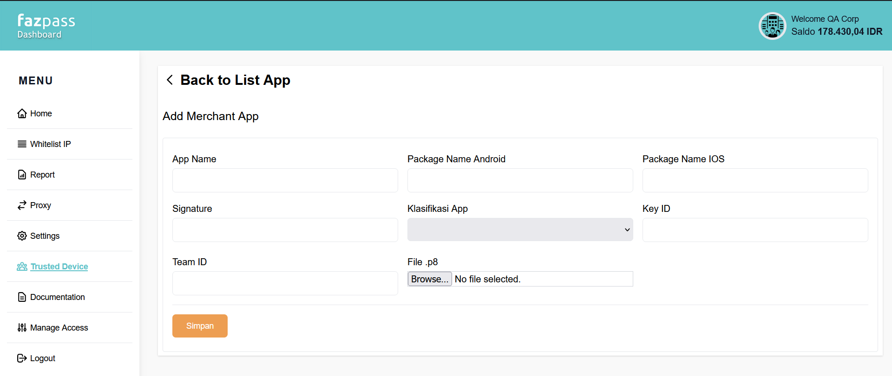

# flutter_trusted_device_v2

Visit [official website](https://fazpass.com) for more information about the product and see documentation at [online documentation](https://doc.fazpass.com) for more technical details.

## Minimum OS

Android 24, IOS 13.0

## Installation

For installation, please refer to these documentation:

Android: https://github.com/fazpass/seamless-documentation/blob/main/README.Android.md#installation <br>
IOS (Use Cocoapods Intallation): https://github.com/fazpass/seamless-documentation/blob/main/README.iOS.md#installation <br>

After the installation is finished, go back immediately to this documentation.

## Bridging between native SDK and Flutter Application

To use native SDK on your flutter application, you have to bridge it by writing native code in your native project, then import it in your flutter project.

### Writing Native Code in Android

Make sure Fazpass SDK is installed correctly by importing the SDK in your android project. If there is no error, then continue reading.

1. Open your android project, then find your main activity file (app/src/main/kotlin/<app_package>/MainActivity.kt). Then make these changes:

```kotlin
// Change this import:
// import io.flutter.embedding.android.FlutterActivity
// into this:
import io.flutter.embedding.android.FlutterFragmentActivity

// Change MainActivity superclass from FlutterActivity to FlutterFragmentActivity
class MainActivity: /*FlutterActivity()*/ FlutterFragmentActivity() {
    // ...

    override fun configureFlutterEngine(flutterEngine: FlutterEngine) {
        super.configureFlutterEngine(flutterEngine)
        flutterEngine.plugins.add(FazpassPlugin(this))
    }
}
```

2. Create the FazpassPlugin class:

```kotlin
class FazpassPlugin(
    activity: FragmentActivity
): FlutterPlugin {

    private val fazpass = FazpassFactory.getInstance()
    private val callHandler = FazpassMethodCallHandler(activity, fazpass)
    private val cdStreamHandler = FazpassCDStreamHandler(activity, fazpass)
    private lateinit var channel: MethodChannel
    private lateinit var cdChannel: EventChannel

    companion object {
        private const val CHANNEL = "com.fazpass.trusted-device"
        private const val CD_CHANNEL = "com.fazpass.trusted-device-cd"
    }

    override fun onAttachedToEngine(binding: FlutterPlugin.FlutterPluginBinding) {
        channel = MethodChannel(binding.binaryMessenger, CHANNEL)
        channel.setMethodCallHandler(callHandler)
        cdChannel = EventChannel(binding.binaryMessenger, CD_CHANNEL)
        cdChannel.setStreamHandler(cdStreamHandler)
    }

    override fun onDetachedFromEngine(binding: FlutterPlugin.FlutterPluginBinding) {
        channel.setMethodCallHandler(null)
        cdStreamHandler.onCancel(null)
        cdChannel.setStreamHandler(null)
    }
}
```

3. Create the FazpassMethodCallHandler class:

```kotlin
class FazpassMethodCallHandler(
    private val activity: FragmentActivity,
    private val fazpass: Fazpass
): MethodChannel.MethodCallHandler {

    init {
        fazpass.init(activity, "new-public-key.pub")
    }

    override fun onMethodCall(call: MethodCall, result: MethodChannel.Result) {
        when (call.method) {
            "generateMeta" -> {
                val accountIndex = call.arguments as Int
                fazpass.generateMeta(activity, accountIndex) { meta, error ->
                    if (error == null) {
                        result.success(meta)
                        return@generateMeta
                    }
                    result.error(
                        "fazpass-${error.name}",
                        error.exception.message,
                        null
                    )
                }
            }
            "generateNewSecretKey" -> {
                try {
                    fazpass.generateNewSecretKey(activity)
                    result.success(null)
                } catch (e: Exception) {
                    result.error("fazpass-Error", e.message, null)
                }
            }
            "getSettings" -> {
                val accountIndex = call.arguments as Int
                val settings = fazpass.getSettings(accountIndex)
                result.success(settings?.toString())
            }
            "setSettings" -> {
                val args = call.arguments as Map<*, *>
                val accountIndex = args["accountIndex"] as Int
                val settingsString = args["settings"] as String?
                val settings = if (settingsString != null) FazpassSettings.fromString(settingsString) else null
                fazpass.setSettings(activity, accountIndex, settings)
                result.success(null)
            }
            "getCrossDeviceDataFromNotification" -> {
                val request = fazpass.getCrossDeviceDataFromNotification(activity.intent)
                result.success(request?.toMap())
            }
            "getAppSignatures" -> {
                val appSignatures = fazpass.getAppSignatures(activity)
                result.success(appSignatures)
            }
            else -> result.notImplemented()
        }
    }
}
```

4. Create FazpassCDStreamHandler class:

```kotlin
class FazpassCDStreamHandler(
    activity: FragmentActivity,
    fazpass: Fazpass
): EventChannel.StreamHandler {

    private val stream = fazpass.getCrossDeviceDataStreamInstance(activity)

    override fun onListen(arguments: Any?, events: EventChannel.EventSink?) {
        stream.listen {
            events?.success(it.toMap())
        }
    }

    override fun onCancel(arguments: Any?) {
        stream.close()
    }
}
```

### Writing Native Code in iOS

Make sure Fazpass SDK is installed correctly by importing the SDK in your ios project. If there is no error, then continue reading.

1. Refer to this [Flutter Official documentation](https://docs.flutter.dev/platform-integration/platform-channels#step-4-add-an-ios-platform-specific-implementation) to setup native code writing
2. Create FazpassMethodCallHandler class:

```swift
import Flutter
import UIKit
import ios_trusted_device_v2

public class FazpassPlugin: NSObject, FlutterPlugin {
    
    public static func register(with registrar: FlutterPluginRegistrar) {
        let channel = FlutterMethodChannel(name: "com.fazpass.trusted-device", binaryMessenger: registrar.messenger())
        let crossDeviceEvent = FlutterEventChannel(name: "com.fazpass.trusted-device-cd", binaryMessenger: registrar.messenger())
        let instance = FazpassPlugin()
        registrar.addMethodCallDelegate(instance, channel: channel)
        crossDeviceEvent.setStreamHandler(CrossDeviceEventHandler())

        Fazpass.shared.`init`(publicAssetName: "new-public-key.pub", application: UIApplication.shared, fcmAppId: "fcm-app-id")
    }
    
    public func handle(_ call: FlutterMethodCall, result: @escaping FlutterResult) {
        switch call.method {
        case "generateMeta":
            let accountIndex = call.arguments as! Int
            Fazpass.shared.generateMeta(accountIndex: accountIndex) { meta, fazpassError in
                guard fazpassError != nil else {
                    result(meta)
                    return
                }
                
                switch (fazpassError!) {
                case .biometricNoneEnrolled:
                    result(
                        FlutterError(
                            code: "fazpassE-biometricNoneEnrolled",
                            message: "Device can't start biometry authentication because there is no biometry (Touch ID or Face ID) or device passcode enrolled.",
                            details: nil
                        )
                    )
                case .biometricAuthFailed:
                    result(
                        FlutterError(
                            code: "fazpassE-biometricAuthFailed",
                            message: "Biometry authentication is finished with an error (e.g. User cancelled biometric auth, etc).",
                            details: nil
                        )
                    )
                case .biometricNotAvailable:
                    result(
                        FlutterError(
                            code: "fazpassE-biometricUnavailable",
                            message: "Device can't start biometry authentication because biometry is unavailable.",
                            details: nil
                        )
                    )
                case .biometricNotInteractive:
                    result(
                        FlutterError(
                            code: "fazpassE-biometricUnsupported",
                            message: "Device can't start biometry authentication because displaying the required authentication user interface is forbidden. To fix this, you have to permit the display of the authentication UI by setting the interactionNotAllowed property to false.",
                            details: nil
                        )
                    )
                case .encryptionError(let message):
                    result(
                        FlutterError(
                            code: "fazpassE-encryptionError",
                            message: "Encryption went wrong because you used the wrong public key. message: \(message)",
                            details: nil
                        )
                    )
                case .publicKeyNotExist:
                    result(
                        FlutterError(
                            code: "fazpassE-publicKeyNotExist",
                            message: "Public key with the name registered in init method doesn't exist as an asset.",
                            details: nil
                        )
                    )
                case .uninitialized:
                    result(
                        FlutterError(
                            code: "fazpassE-uninitialized",
                            message: "Fazpass init method hasn't been called once.",
                            details: nil
                        )
                    )
                }
            }
        case "generateNewSecretKey":
            do {
                try Fazpass.shared.generateNewSecretKey()
                result(nil)
            } catch {
                result(FlutterError(code: "fazpassE-Error", message: error.localizedDescription, details: nil))
            }
        case "getSettings":
            let accountIndex = call.arguments as! Int
            let settings = Fazpass.shared.getSettings(accountIndex: accountIndex)
            result(settings?.toString())
        case "setSettings":
            let args = call.arguments as! Dictionary<String, Any>
            var settings: FazpassSettings?
            if (args["settings"] is String) {
                settings = FazpassSettings.fromString(args["settings"] as! String)
            }
            Fazpass.shared.setSettings(accountIndex: args["accountIndex"] as! Int, settings: settings)
            result(nil)
        case "getCrossDeviceDataFromNotification":
            let request = Fazpass.shared.getCrossDeviceDataFromNotification(userInfo: nil)
            result(request?.toDict())
        default:
          result(FlutterMethodNotImplemented)
        }
    }
    
    class CrossDeviceEventHandler: NSObject, FlutterStreamHandler {
        
        private let stream = Fazpass.shared.getCrossDeviceDataStreamInstance()
        
        func onListen(withArguments arguments: Any?, eventSink events: @escaping FlutterEventSink) -> FlutterError? {
            stream.listen { request in
                events(request.toDict())
            }
            return nil
        }
        
        func onCancel(withArguments arguments: Any?) -> FlutterError? {
            stream.close()
            return nil
        }
        
        
    }
}
```

### Using Written Native Code in Flutter

1. Create Fazpass class:

```dart
class Fazpass {
  static const _CHANNEL = 'com.fazpass.trusted-device';
  static const _CD_CHANNEL = 'com.fazpass.trusted-device-cd';

  static const instance = Fazpass();
  
  const Fazpass();

  final methodChannel = const MethodChannel(_CHANNEL);
  final eventChannel = const EventChannel(_CD_CHANNEL);

  Future<String> generateMeta({int accountIndex=-1}) async {
    String meta = '';
    try {
      meta = await methodChannel.invokeMethod<String>('generateMeta', accountIndex) ?? '';
    } on PlatformException catch (e) {
      switch (e.code) {
        case 'fazpass-BiometricNoneEnrolledError':
          throw BiometricNoneEnrolledError(e);
        case 'fazpass-BiometricAuthFailedError':
          throw BiometricAuthFailedError(e);
        case 'fazpass-BiometricUnavailableError':
          throw BiometricUnavailableError(e);
        case 'fazpass-BiometricUnsupportedError':
          throw BiometricUnsupportedError(e);
        case 'fazpass-PublicKeyNotExistException':
          throw PublicKeyNotExistException(e);
        case 'fazpass-UninitializedException':
          throw UninitializedException(e);
        case 'fazpass-BiometricSecurityUpdateRequiredError':
          throw BiometricSecurityUpdateRequiredError(e);
        case 'fazpass-EncryptionException':
        default:
          throw EncryptionException(e);
      }
    }
    return meta;
  }

  Future<void> generateNewSecretKey() async {
    return methodChannel.invokeMethod('generateNewSecretKey');
  }

  Future<FazpassSettings?> getSettings(int accountIndex) async {
    final settingsString = await methodChannel.invokeMethod('getSettings', accountIndex);
    if (settingsString is String) {
      return FazpassSettings.fromString(settingsString);
    }
    return null;
  }

  Future<void> setSettings(int accountIndex, FazpassSettings? settings) async {
    return await methodChannel.invokeMethod('setSettings', {"accountIndex": accountIndex, "settings": settings?.toString()});
  }

  Stream<CrossDeviceData> getCrossDeviceDataStreamInstance() {
    return eventChannel.receiveBroadcastStream().map((event) => CrossDeviceData.fromData(event));
  }

  Future<CrossDeviceData?> getCrossDeviceDataFromNotification() async {
    final data = await methodChannel.invokeMethod('getCrossDeviceDataFromNotification');
    return data == null ? null : CrossDeviceData.fromData(data);
  }

  Future<List<String>> getAppSignatures() async {
    if (Platform.isAndroid) {
      final signatures = await methodChannel.invokeListMethod<String>('getAppSignatures');
      return signatures ?? [];
    }

    return [];
  }
}
```

2. Create CrossDeviceData class:

```dart
class CrossDeviceData {
  final String merchantAppId;
  final String deviceReceive;
  final String deviceRequest;
  final String deviceIdReceive;
  final String deviceIdRequest;
  final String expired;
  final String status;
  final String? notificationId;
  final String? action;

  CrossDeviceData.fromData(Map data) :
        merchantAppId = data["merchant_app_id"] as String,
        deviceReceive = data["device_receive"] as String,
        deviceRequest = data["device_request"] as String,
        deviceIdReceive = data["device_id_receive"] as String,
        deviceIdRequest = data["device_id_request"] as String,
        expired = data["expired"] as String,
        status = data["status"] as String,
        notificationId = data["notification_id"] as String?,
        action = data["action"] as String?;
}
```

3. Create FazpassException classes:

```dart
import 'package:flutter/services.dart';

sealed class FazpassException extends PlatformException {
  FazpassException(PlatformException e)
      : super(code: e.code, message: e.message);
}

class BiometricNoneEnrolledError extends FazpassException {
  BiometricNoneEnrolledError(super.e);
}

class BiometricAuthFailedError extends FazpassException {
  BiometricAuthFailedError(super.e);
}

class BiometricUnavailableError extends FazpassException {
  BiometricUnavailableError(super.e);
}

class BiometricUnsupportedError extends FazpassException {
  BiometricUnsupportedError(super.e);
}

class EncryptionException extends FazpassException {
  EncryptionException(super.e);
}

class PublicKeyNotExistException extends FazpassException {
  PublicKeyNotExistException(super.e);
}

class UninitializedException extends FazpassException {
  UninitializedException(super.e);
}

class BiometricSecurityUpdateRequiredError extends FazpassException {
  BiometricSecurityUpdateRequiredError(super.e);
}
```

4. Create FazpassSettings class:

```dart
class FazpassSettings {
  final List<SensitiveData> _sensitiveData;
  final bool _isBiometricLevelHigh;

  List<SensitiveData> get sensitiveData => _sensitiveData.toList();
  bool get isBiometricLevelHigh => _isBiometricLevelHigh;

  FazpassSettings._(this._sensitiveData, this._isBiometricLevelHigh);

  factory FazpassSettings.fromString(String settingsString) {
    final splitter = settingsString.split(";");
    final sensitiveData = splitter[0].split(",")
        .takeWhile((it) => it != "")
        .map((it) => SensitiveData.values.firstWhere((element) => element.name == it))
        .toList();
    final isBiometricLevelHigh = bool.tryParse(splitter[1]) ?? false;

    return FazpassSettings._(sensitiveData, isBiometricLevelHigh);
  }

  @override
  String toString() => "${_sensitiveData.map((it) => it.name).join(",")};$_isBiometricLevelHigh";
}

class FazpassSettingsBuilder {
  final List<SensitiveData> _sensitiveData;
  bool _isBiometricLevelHigh;

  List<SensitiveData> get sensitiveData => _sensitiveData.toList();
  bool get isBiometricLevelHigh => _isBiometricLevelHigh;

  FazpassSettingsBuilder()
      : _sensitiveData = [],
        _isBiometricLevelHigh = false;

  FazpassSettingsBuilder.fromFazpassSettings(FazpassSettings settings)
      : _sensitiveData = [...settings._sensitiveData],
        _isBiometricLevelHigh = settings._isBiometricLevelHigh;

  FazpassSettingsBuilder enableSelectedSensitiveData(List<SensitiveData> sensitiveData) {
    for (final data in sensitiveData) {
      if (_sensitiveData.contains(data)) {
        continue;
      } else {
        _sensitiveData.add(data);
      }
    }
    return this;
  }

  FazpassSettingsBuilder disableSelectedSensitiveData(List<SensitiveData> sensitiveData) {
    for (final data in sensitiveData) {
      if (_sensitiveData.contains(data)) {
        _sensitiveData.remove(data);
      } else {
        continue;
      }
    }
    return this;
  }

  FazpassSettingsBuilder setBiometricLevelToHigh() {
    _isBiometricLevelHigh = true;
    return this;
  }

  FazpassSettingsBuilder setBiometricLevelToLow() {
    _isBiometricLevelHigh = false;
    return this;
  }

  FazpassSettings build() => FazpassSettings._(
      _sensitiveData,
      _isBiometricLevelHigh);
}
```

## Getting Started

Before using this package, make sure to contact us first to get a public key and an FCM App ID (iOS only).
This package main purpose is to generate meta which you can use to communicate with Fazpass rest API.

### Getting Started on Android

Setup your public key:
1. Open your android folder, then go to app/src/main/assets/ (if assets folder doesn't exist, create a new one)
2. Put the public key in this folder

Then, open your styles.xml file (app/src/main/res/values/styles.xml) and change the parent theme to AppCompat theme (or descendant):

```xml
<?xml version="1.0" encoding="utf-8"?>
<resources>
    <!-- Theme applied to the Android Window while the process is starting when the OS's Dark Mode setting is off -->
    <!-- change parent LaunchTheme from this: -->
    <!-- <style name="LaunchTheme" parent="@android:style/Theme.Light.NoTitleBar"> -->
    <!-- to this: -->
    <style name="LaunchTheme" parent="@style/Theme.AppCompat.Light.NoActionBar">
        <!-- Show a splash screen on the activity. Automatically removed when
             the Flutter engine draws its first frame -->
        <item name="android:windowBackground">@drawable/launch_background</item>
    </style>
    <!-- Theme applied to the Android Window as soon as the process has started.
         This theme determines the color of the Android Window while your
         Flutter UI initializes, as well as behind your Flutter UI while its
         running.

         This Theme is only used starting with V2 of Flutter's Android embedding. -->
    <!-- change parent NormalTheme from this: -->
    <!-- <style name="NormalTheme" parent="@android:style/Theme.Light.NoTitleBar"> -->
    <!-- to this: -->
    <style name="NormalTheme" parent="@style/Theme.AppCompat.Light.NoActionBar">
        <item name="android:windowBackground">?android:colorBackground</item>
    </style>
</resources>
```

If you have the night variant styles (app/src/main/res/values-night/styles.xml), then you have to change it to dark AppCompat theme:

```xml
<?xml version="1.0" encoding="utf-8"?>
<resources>
    <!-- Theme applied to the Android Window while the process is starting when the OS's Dark Mode setting is on -->
    <style name="LaunchTheme" parent="@style/Theme.AppCompat.DayNight.NoActionBar">
        <!-- Show a splash screen on the activity. Automatically removed when
             the Flutter engine draws its first frame -->
        <item name="android:windowBackground">@drawable/launch_background</item>
    </style>
    <!-- Theme applied to the Android Window as soon as the process has started.
         This theme determines the color of the Android Window while your
         Flutter UI initializes, as well as behind your Flutter UI while its
         running.

         This Theme is only used starting with V2 of Flutter's Android embedding. -->
    <style name="NormalTheme" parent="@style/Theme.AppCompat.DayNight.NoActionBar">
        <item name="android:windowBackground">?android:colorBackground</item>
    </style>
</resources>
```

#### Retrieving your application signatures

When creating a new merchant app in Fazpass Dashboard, there is a "signature" input.



Here's how to get this signature:

Add this line of code in your main widget initState() method
```dart
@override
void initState() {
  super.initState();
  
  // add this line
  Fazpass.instance.getAppSignatures().then((value) => print("APPSGN: $value"));
}
```
Then build apk for release. Launch it while your device is still connected and debugging in your pc.
Open logcat and query for `APPSGN`. It's value is an array, will look something like this: `[Gw+6AWbS7l7JQ7Umb1zcs1aNA8M=]`.
If item is more than one, pick just one of them. Copy the signature `Gw+6AWbS7l7JQ7Umb1zcs1aNA8M=` and fill the signature
of your merchant app with this value.

After you uploaded your apk or abb into the playstore, download your app from the playstore then check your app's signatures again.
If it's different, make sure to update the signature value of your merchant app.

### Getting Started on iOS

Setup your public key:
1. In your XCode project, open Assets.
2. Add new asset as Data Set.
3. Reference your public key into this asset.
4. Name your asset.

Then, you have to declare NSFaceIDUsageDescription in your Info.plist file to be able to generate meta, because generating meta requires user to do biometry authentication.

Then, in your AppDelegate.swift file in your XCode project, override your `didReceiveRemoteNotification` function.
```swift
override func application(_ application: UIApplication, didReceiveRemoteNotification userInfo: [AnyHashable : any], fetchCompletionHandler completionHandler: @escaping (UIBackgroundFetchResult) -> Void) {
  
  // add this line
  Fazpass.shared.getCrossDeviceDataFromNotification(userInfo: userInfo)

  completionHandler(UIBackgroundFetchResult.newData)
}
```

## Usage

Call `generateMeta()` method to launch local authentication (biometric / password) and generate meta
if local authentication is success. Otherwise throws `BiometricAuthFailedError`.
```dart
String meta = '';
try {
  meta = await Fazpass.instance.generateMeta();
} on FazpassException catch (e) {
  switch (e) {
    case BiometricNoneEnrolledError():
      // TODO
      break;
    case BiometricAuthFailedError():
      // TODO
      break;
    case BiometricUnavailableError():
      // TODO
      break;
    case BiometricUnsupportedError():
      // TODO
      break;
    case EncryptionException():
      // TODO
      break;
    case PublicKeyNotExistException():
      // TODO
      break;
    case UninitializedException():
      // TODO
      break;
    case BiometricSecurityUpdateRequiredError():
      // TODO
      break;
  }
}
```

## Exceptions & Errors

#### UninitializedException

Produced when fazpass init method hasn't been called once.

#### PublicKeyNotExistException

- Android: Produced when public key with the name registered in init method doesn't exist in the assets directory.
- iOS: Produced when public key with the name registered in init method doesn't exist as an asset.

#### EncryptionException

Produced when encryption went wrong because you used the wrong public key.

#### BiometricAuthError

Produced when biometric authentication is finished with an error. (example: User cancelled biometric auth, User failed biometric auth too many times, and many more).

#### BiometricUnavailableError

- Android: Produced when device can't start biometric authentication because there is no suitable hardware (e.g. no biometric sensor or no keyguard) or the hardware is unavailable.
- iOS: Produced when device can't start biometry authentication because biometry is unavailable.

#### BiometricNoneEnrolledError

- Android: Produced when device can't start biometric authentication because there is no biometric (e.g. Fingerprint, Face, Iris) or device credential (e.g. PIN, Password, Pattern) enrolled.
- iOS: Produced when device can't start biometry authentication because there is no biometry (Touch ID or Face ID) or device passcode enrolled.

#### BiometricUnsupportedError

- Android: Produced when device can't start biometric authentication because the specified options are incompatible with the current Android version.
- iOS: Produced when device can't start biometry authentication because displaying the required authentication user interface is forbidden. To fix this, you have to permit the display of the authentication UI by setting the interactionNotAllowed property to false.

### Android Exclusive Exceptions

#### BiometricSecurityUpdateRequiredError

Produced when device can't start biometric authentication because a security vulnerability has been discovered with one or
more hardware sensors. The affected sensor(s) are unavailable until a security update has addressed the issue.

## Set preferences for data collection

This package supports application with multiple accounts, and each account can have different settings for generating meta.
To set preferences for data collection, call `setSettings()` method.

```dart
// index of an account
int accountIndex = 0;

// create preferences
FazpassSettings settings = FazpassSettingsBuilder()
  .enableSelectedSensitiveData([SensitiveData.location])
  .setBiometricLevelToHigh()
  .build();

// save preferences
await Fazpass.instance.setSettings(accountIndex, settings);

// apply saved preferences by using the same account index
String meta = await Fazpass.instance.generateMeta(accountIndex: accountIndex);

// delete saved preferences
await Fazpass.instance.setSettings(accountIndex, null);
```

`generateMeta()` accountIndex parameter has -1 as it's default value.

> We strongly advised against saving preferences into default account index. If your application
> only allows one active account, use 0 instead.

## Data Collection

Data collected and stored in generated meta. Based on how data is collected, data type is divided into three: 
General data, Sensitive data and Other.
General data is always collected while Sensitive data requires more complicated procedures before they can be collected. 
Other is a special case. They collect a complicated test result, and might change how `generateMeta()` method works.

To enable Sensitive data collection, you need to set preferences for them and
specifies which sensitive data you want to collect.
```dart
FazpassSettingsBuilder builder = FazpassSettingsBuilder()
    .enableSelectedSensitiveData([
      SensitiveData.location,
      SensitiveData.simNumbersAndOperators,
      SensitiveData.vpn
]);
```
Then, you have to follow the procedure on how to enable each of them as described in their own segment down below.

For others, you also need to set preferences for them and specifies which you want to enable.
```dart
FazpassSettingsBuilder builder = FazpassSettingsBuilder()
    .setBiometricLevelToHigh();
```
For detail, read their description in their own segment down below.

### General data collected

* Your device platform name (Value will be "android" on android, and "ios" on iOS).
* Your app package name (bundle identifier on iOS).
* Your app debug status.
* Your device rooted status (jailbroken status on iOS).
* Your device emulator/simulator status.
* Your app cloned status. (Android only)
* Your device mirroring or projecting status.
* Your app signatures. (Android only)
* Your device information (Android/iOS version, phone brand/model, phone type, phone cpu).
* Your network IP Address.
* Your network vpn status. (Android only)

### Sensitive data collected

#### Your device location and mock location status

AVAILABILITY: ANDROID, IOS

To enable location on android, make sure you ask user for these permissions:
- android.permission.ACCESS_COARSE_LOCATION or android.permission.ACCESS_FINE_LOCATION
- android.permission.FOREGROUND_SERVICE

To enable location on ios, declare NSLocationWhenInUseUsageDescription in your Info.plist file.

#### Your device SIM numbers and operators (if available)

AVAILABILITY: ANDROID

To enable sim numbers and operators on android, make sure you ask user for these permissions:
* android.permission.READ_PHONE_NUMBERS
* android.permission.READ_PHONE_STATE

#### Your network vpn status

AVAILABILITY: IOS

To enable vpn on iOS, enable the Network Extensions capability in your Xcode project.

### Other data collected

#### High-level biometric

Enabling high-level biometrics makes the local authentication in `generateMeta()` method use ONLY biometrics, 
preventing user to use password as another option. After enabling this for the first time, immediately call `generateNewSecretKey()`
method to create a secret key that will be stored safely in device keystore provider. From now on, calling `generateMeta()`
with High-level biometric preferences will conduct an encryption & decryption test using the newly created secret key. 
whenever the test is failed, it means the secret key has been invalidated because one these occurred:
- Device has enrolled another biometric information (new fingerprints, face, or iris)
- Device has cleared all biometric information
- Device removed their device passcode (password, pin, pattern, etc.)

When secret key has been invalidated, trying to hit Fazpass Check API will fail. The recommended action for this is
to sign out every account that has enabled high-level biometric and make them sign in again with low-level biometric settings.
If you want to re-enable high-level biometrics after the secret key has been invalidated, make sure to 
call `generateNewSecretKey()` once again.

## Handle incoming Cross Device Notification

When application is in background state (not running), incoming cross device notification will enter your system notification tray
and shows them as a notification. Pressing said notification will launch the application with cross device data as an argument.
When application is in foreground state (currently running), incoming cross device notification will immediately sent into the application
without showing any notification.

To retrieve cross device notification data when app is in background state, you have to call `getCrossDeviceDataFromNotification()` method.
```dart
CrossDeviceData data = await Fazpass.instance.getCrossDeviceDataFromNotification();
```

To retrieve cross device notification data when app is in foreground state, you have to get the stream instance by calling
`getCrossDeviceDataStreamInstance()` then start listening to the stream.
```dart
// get the stream instance
Stream<CrossDeviceData> crossDeviceStream = Fazpass.instance.getCrossDeviceDataStreamInstance();

// start listening to the stream
StreamSubscription<CrossDeviceData> crossDeviceSubs = crossDeviceStream.listen((CrossDeviceData data) {
  // called everytime there is an incoming cross device notification
  print(data);
  
  if (data.status == "request") {
    String notificationId = data.notificationId!;
    print(notificationId);
  } else if (data.status == "validate") {
    String action = data.action!;
    print(action);
  }
});

// stop listening to the stream
crossDeviceSubs.cancel();
```
