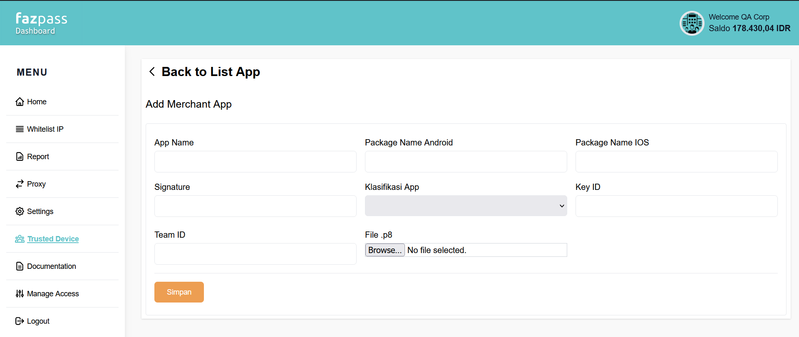

# ios-trusted-device-v2

Visit [official website](https://fazpass.com) for more information about the product and see documentation at [online documentation](https://doc.fazpass.com) for more technical details.

## Minimum OS

iOS 13.0

## Installation

You can add this package into your project using swift package manager (SPM) or Cocoapods. Make sure you have prepared the access token by contacting Fazpass.

### Using Swift Package

1. Open Xcode, then open Xcode settings (Xcode -> Settings...)
2. In Accounts, press the + button on the bottom left, then pick GitHub
3. Fill the Account field with 'fazpass-sdk', then fill the Token field with the access token
4. Click Sign In
5. After github source control account is added successfully, close settings window. Then click File > Add Packages...
6. Enter this package URL: https://github.com/fazpass-sdk/ios-trusted-device-v2.git
7. If there is a prompt to login, pick the github account you just added
8. Click Add Package

### Using Cocoapods

1. Open terminal in your project directory
2. Run `pod repo add ios-trusted-device-v2 https://fazpass-sdk@github.com/fazpass-sdk/ios-trusted-device-v2.git`
3. If asked for credentials, use 'fazpass-sdk' as username, then use the access token as password
4. Then in your Podfile, add 'ios-trusted-device-v2' as a dependency pod in your target:

```Podfile
pod 'ios-trusted-device-v2', :git => 'https://github.com/fazpass-sdk/ios-trusted-device-v2.git'
```

## Getting Started

Before using this SDK, make sure to get the public key from Fazpass Dashboard's merchant app. Then, reference the public key in the Assets.

1. In your Xcode project, open Assets.
2. Add new asset as Data Set.
3. Reference your public key into this asset.
4. Name your asset.

Then, you have to declare NSFaceIDUsageDescription in your Info.plist file to be able to generate meta, because 
generating meta requires user to do biometry authentication.

You also have to enable 2 capabilities in xcode for your app. In the Signing & capabilities for your target, add these capabilities:

1. Push Notifications.
2. App Groups. Then add this container: "group.com.fazpass.ios-trusted-device-v2"


### Retrieving your application Key ID, Team ID and File .p8

When creating a new merchant app in Fazpass Dashboard, there is a "Key ID", "Team ID", and "File .p8" input.



Here's how to get them:

1. Visit the [Apple Developer Member Center](https://developer.apple.com/account) and sign in with your credentials.
2. Find the 'Membership details' card. Then copy the Team ID value and fill it in the "Team ID" input.


3. Then you have to create an Apple Push Notification (APN key). In the same page, find 'Program resources' card. Then pick 'Keys'.


4. Click on the '+' button right beside the title 'Keys'.


5. Fill the key name and check 'Apple Push Notifications service (APNs)'. Then click the 'Continue' button. Finally click the 'Register' button.


6. Copy the Key ID value and fill it in the "Key ID" input. Then click the 'Download' button to download the apn key file.


7. Upload the apn key file in the "File .p8" input.

## Usage

This package main purpose is to generate meta which you can use to communicate with Fazpass rest API. But
before calling generate meta method, you have to initialize it first by calling this method in your app delegate `didFinishLaunchingWithOptions`:
```swift
func application(_ application: UIApplication, didFinishLaunchingWithOptions launchOptions: [UIApplication.LaunchOptionsKey : Any]? = nil) -> Bool {
    // Initialize fazpass
    Fazpass.shared.`init`(
        publicAssetName: "YOUR_PUBLIC_KEY_ASSET_NAME",
        application: application,
        fcmAppId: "YOUR_FCM_APP_ID"
    )
    
    return true
}
```

Call `generateMeta()` method to automatically launch local authentication (biometric / password). 
If authentication is success, meta will be generated. Otherwise `biometricAuthFailed` error will occurs.

```swift
Fazpass.shared.generateMeta { meta, fazpassError in 
    guard let error = fazpassError else {
        print(meta)
    }
    
    switch (error) {
    case .biometricNoneEnrolled:
        // code...
    case .biometricAuthFailed:
        // code...
    case .biometricNotAvailable(let message):
        // code...
    case .biometricNotInteractive:
        // code...
    case .encryptionError(let message):
        // code...
    case .publicKeyNotExist:
        // code...
    case .uninitialized:
        // code...
    }
}
```

### Seamless Best Practice


Everytime you want to check your device by hitting Seamless API Check, you should generate a new meta from `generateMeta()` method to ensure your seamless status is up-to-date with your device current state. After a flow is finished, you have to start from the beginning to do another operation. Meta should not be saved into any persistent storage (user defaults, local storage, database, etc.). But, generating meta too many times might leads to a bad user experience, since they have to do biometric authentication everytime meta is about to be generated. You should only check your device when you are about to do sensitive action (Login, Payment, etc.). For example, if you have an online store app, instead of checking your device for every item you add into your cart, it is better to just check your device when you are about to pay for everything in your cart.

## Errors

#### biometricNoneEnrolled

Produced when device can't start biometry authentication because there is no biometry (Touch ID or Face ID) or device passcode enrolled.

#### biometricAuthFailed

Produced when biometry authentication is finished with an error (e.g. User cancelled biometric auth, etc).

#### biometricNotAvailable

Produced when device can't start biometry authentication because biometry is unavailable.

#### biometricNotInteractive

Produced when device can't start biometry authentication because displaying the required authentication user interface is forbidden. To fix this, you have to permit the display of the authentication UI by setting the interactionNotAllowed property to false.

#### encryptionError

Produced when encryption went wrong because you used the wrong public key. Gives you string message of what went wrong.

#### publicKeyNotExist

Produced when public key with the name registered in init method doesn't exist as an asset.

#### uninitialized

Produced when fazpass init method hasn't been called once.

## Set preferences for data collection

This package supports application with multiple accounts, and each account can have different settings for generating meta.
To set preferences for data collection, call `setSettings()` method.

```swift
// index of an account
let accountIndex = 0

// create preferences
let settings: FazpassSettings = FazpassSettingsBuilder()
  .enableSelectedSensitiveData(sensitiveData: SensitiveData.location)
  .setBiometricLevelToHigh()
  .build()

// save preferences
Fazpass.shared.setSettings(accountIndex, settings)

// apply saved preferences by using the same account index
Fazpass.shared.generateMeta(accountIndex: accountIndex) { meta, error in
  print(meta)
}

// delete saved preferences
Fazpass.shared.setSettings(accountIndex, nil)
```

`generateMeta()` accountIndex parameter has -1 as it's default value.

> We strongly advised against saving preferences into default account index. If your application
> only allows one active account, use 0 instead.

## Data Collection

Data collected and stored in generated meta. Based on how data is collected, data type is divided into three: 
General data, Sensitive data and Other.
General data is always collected while Sensitive data requires more complicated procedures before they can be collected. 
Other is a special case. They collect a complicated test result, and might change how `generateMeta()` method works.

To enable Sensitive data collection, you need to set preferences for them and
specifies which sensitive data you want to collect.
```swift
let builder: FazpassSettings.Builder = FazpassSettings.Builder()
    .enableSelectedSensitiveData(sensitiveData: SensitiveData.location, SensitiveData.vpn)
```
Then, you have to follow the procedure on how to enable each of them as described in their own segment down below.

For others, you also need to set preferences for them and specifies which you want to enable.
```swift
let builder: FazpassSettings.Builder = FazpassSettings.Builder()
    .setBiometricLevelToHigh()
```
For detail, read their description in their own segment down below.

### General data collected

* Your device platform name (Value will always be "ios").
* Your app bundle identifier.
* Your app debug status.
* Your device jailbroken status.
* Your device emulator/simulator status.
* Your device mirroring or projecting status.
* Your device information (iOS version, phone model, phone type, phone cpu).
* Your network IP Address.

### Sensitive data collected

#### Your device location and mock location status

To collect location data, declare NSLocationWhenInUseUsageDescription in your Info.plist file.
When it's enabled, user will be automatically asked to permit the LocationWhenInUse permission when fazpass generate meta method is called.
Location data is collected if the user permit it, otherwise it won't be collected and no error will be produced.

#### Your device vpn status

To collect vpn status data, enable the Network Extensions capability in your Xcode project.

### Other data collected

#### High-level biometric

Enabling high-level biometrics makes the local authentication in `generateMeta()` method use ONLY biometrics, 
preventing user to use password as another option. After enabling this for the first time, immediately call `generateNewSecretKey()`
method to create a secret key that will be stored safely in device keystore provider. From now on, calling `generateMeta()`
with High-level biometric preferences will conduct an encryption & decryption test using the newly created secret key. 
whenever the test is failed, it means the secret key has been invalidated because one these occurred:
- Device has enrolled another biometric information (new fingerprints, face, or iris)
- Device has cleared all biometric information
- Device removed their device passcode (password, pin, pattern, etc.)

When secret key has been invalidated, trying to hit Fazpass Check API will fail. The recommended action for this is
to sign out every account that has enabled high-level biometric and make them sign in again with low-level biometric settings.
If you want to re-enable high-level biometrics after the secret key has been invalidated, make sure to 
call `generateNewSecretKey()` once again.

## Handle incoming Cross Device notification

When application is in background state (not running), incoming cross device notification will enter your system notification tray
and shows them as a notification. Pressing said notification will launch the application with cross device request data as an argument.
When application is in foreground state (currently running), incoming cross device notification will immediately sent into the application without showing any notification.

To retrieve cross device notification data when app is in background state, you have to call `getCrossDeviceDataFromNotification()` method in your app delegate `didReceiveRemoteNotication`.
```swift
func application(_ application: UIApplication, didReceiveRemoteNotification userInfo: [AnyHashable : any]) async -> UIBackgroundFetchResult {
  let data = Fazpass.shared.getCrossDeviceDataFromNotification(userInfo: userInfo)

  return UIBackgroundFetchResult.newData
}
```

To retrieve cross device notification data when app is in foreground state, you have to get the stream instance by calling 
`getCrossDeviceDataStreamInstance()` then start listening to the stream.
```swift
// get the stream instance
let crossDeviceStream = Fazpass.shared.getCrossDeviceDataStreamInstance()

// start listening to the stream
crossDeviceStream.listen { data in
  // called everytime there is an incoming cross device notification
  print(data)
}

// stop listening to the stream
crossDeviceStream.close()
```
