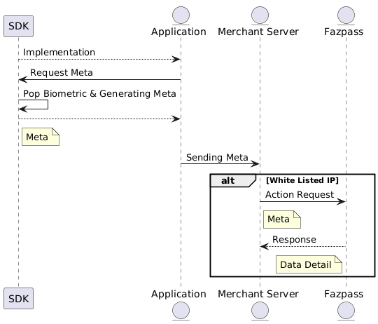
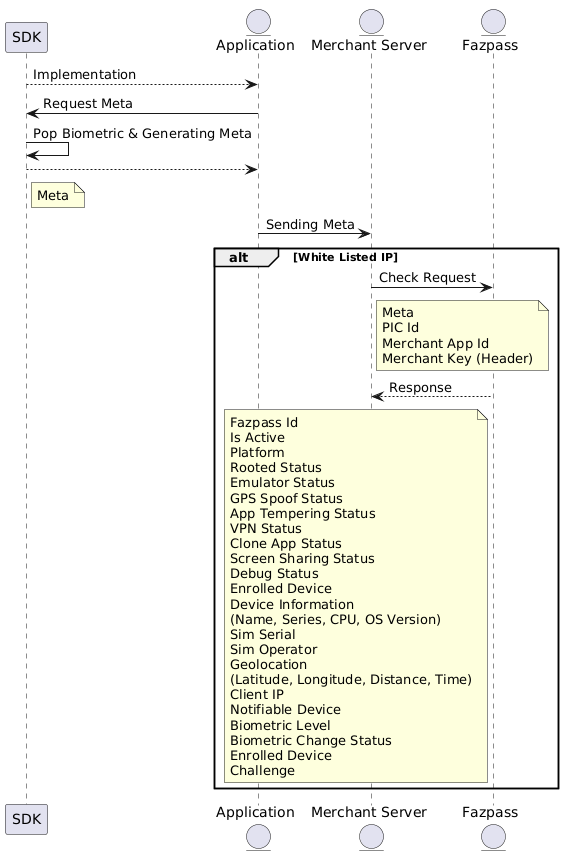
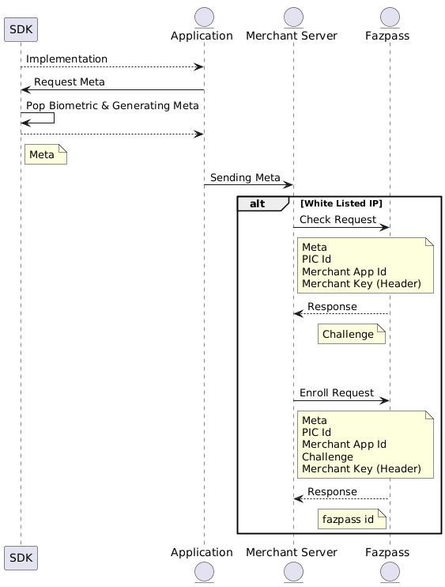
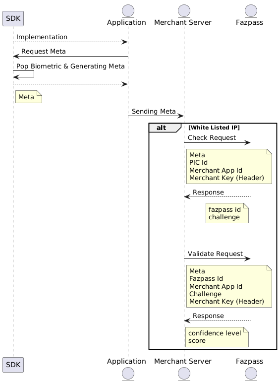
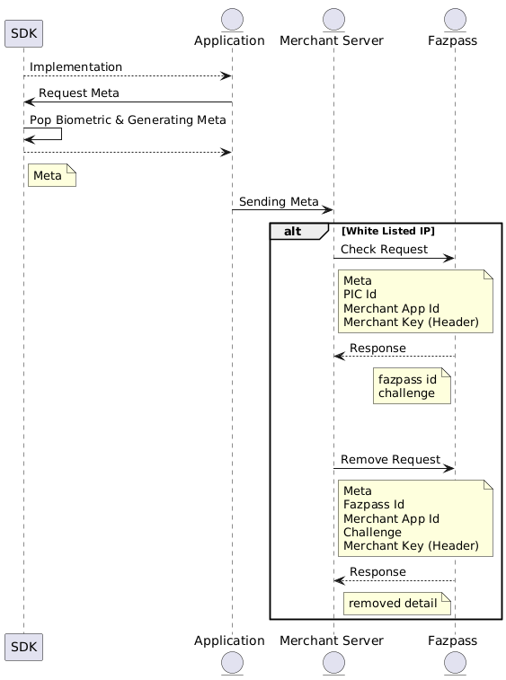
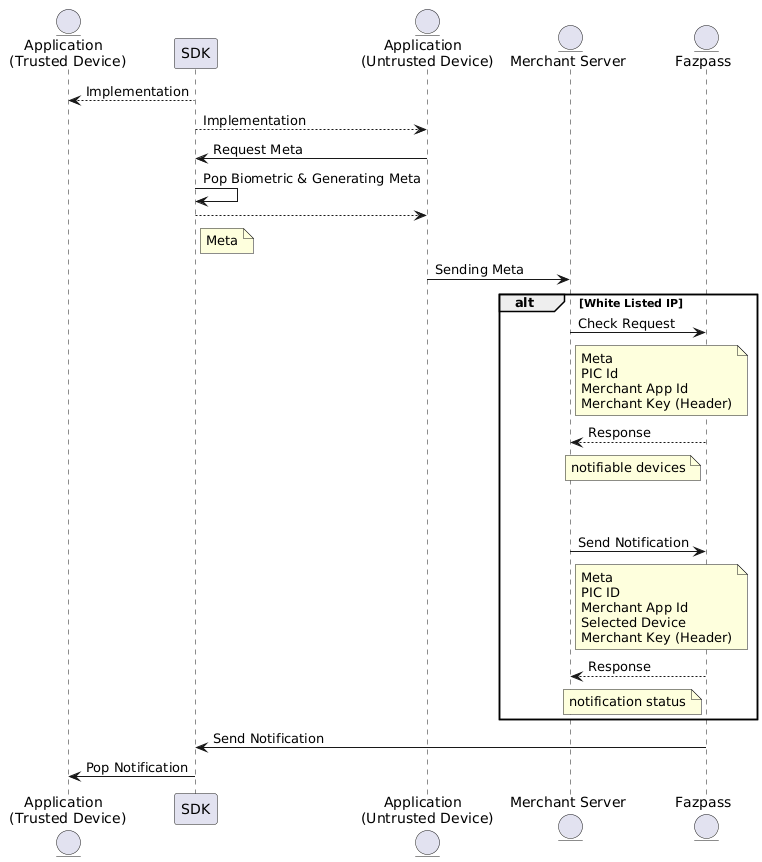
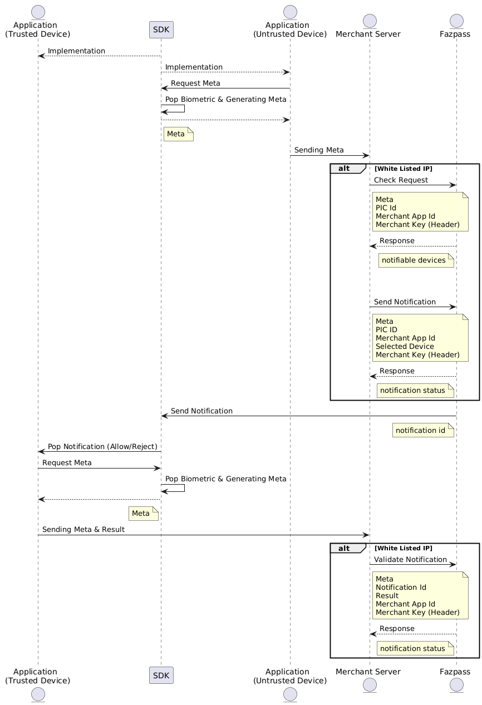
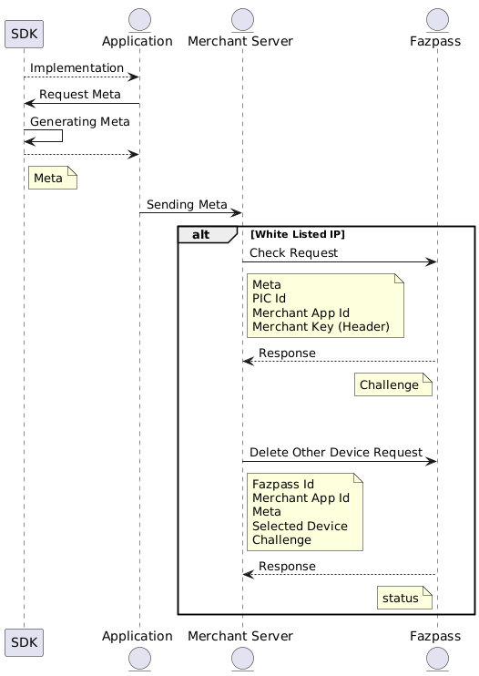

# Seamless

## Content
- [Preparation](#Preparation)
- [What's Meta](#Meta)


## Introduction


## Preparation
### Choose your stack technology and install it.

| No | Stack Technology | Link 		                                                                  |
| -- | --	 			|--------------------------------------------------------------------------|
| 1  | Android Native  	| [Link](README.Android.md)  		     |
| 2  | IOS Native		| [Link](README.iOS.md)  			        |
| 3  | Flutter			| [Link](README.Flutter.md)  		     |
| 4  | React Native		| [Link](README.ReactNative.md)  	 |
| 5  | Web Browser		| [Web Browser](README.Web.md)|                                             |                                                                      |

This sdk will generate META that will be used in the next step. As looked in the chart.

### Whitelist IP
Whitelist IP is used to secure your API from unauthorized access. You can whitelist your IP in [here](https://fazpass.com).

### Endpoint Request Body
BASE URL IS : https://api.fazpass.com
#### Check
URL: /v2/trusted-device/check

Check device status & user. This endpoint also an initiation for other endpoint.
```JSON
"pic_id":"anvarisy@gmail.com/62851++++",
"meta":"encrypted"
"merchant_app_id":"7a8s7sadad7a7gas77das7899089as8dasd"
```


#### Enroll
URL: /v2/trusted-device/enroll

Registering user and device as an authenticated user
```JSON
"pic_id":"anvarisy@gmail.com/62851++++",
"meta":"encrypted",
"merchant_app_id":"com.tokopedia.tkpd",
"challenge":"id"
```

#### Validate
/v2/trusted-device/validate

Validating user and device, this will return score and confidence level of security level.
```JSON
"fazpass_id":"fazpass_id",
"meta":"encrypted",
"merchant_app_id":"com.tokopedia.tkpd",
"challenge":"id"
```


#### Remove
/v2/trusted-device/remove

Remove this user & device from authenticated user
```JSON
"fazpass_id":"fazpass_id",
"meta":"encrypted",
"merchant_app_id":"com.tokopedia.tkpd",
"challenge":"id"
```


#### Send Notification
/v2/trusted-device/send/notification

Send notification into connected device that already trusted
```JSON

"pic_id":"",
"merchant_app_id":"7a8s7sadad7a7gas77das7899089as8dasd",
"meta":"",
"selected_device":"device_id"
```


#### Validate Notification

/v2/trusted-device/validate/notification

Verify if the received notification is valid or not, this will auto enroll user that request send notification.
```JSON
"notification_id":"",
"merchant_app_id":"7a8s7sadad7a7gas77das7899089as8dasd",
"meta":"",
"result":true/false
```


#### Delete Other Device
/v2/trusted-device/remove/another-device
Remove linked device from trusted device
```JSON
{
    "fazpass_id": "17d82ff72ec9343c9fb04a4965265377f144d5ea862737dc",
    "merchant_app_id": "{{APP_ID}}",
    "meta": "{{META_STAGING_UGLY}}",
    "selected_device": "c519a31b-839f-4e33-9bfc-5b64fe38593f",
    "challenge":"95e2c319-4d94-4f5b-bb55-d43ed03a13cc"
}
```


### Handle Response
After you call the API, you will get the response. This should like this
```JSON
"status":true,
"code":200
"data":{
  "meta":""
}
```

## Meta
Meta is an object that contains information about the user's device.
```JSON
{
  "identification":{
      "data":{
        "trx_id":"",
        "challenge":"UUID",
        "fazpass_id":"fazpass_id",
        "scoring":90.0,
        "risk_level":"HIGH/LOW",
        "is_active":true/false,
        "time_stamp":353666389900000,
        "platform":"android/ios",
        "application":"com.fazpass.app"
      }
   },
  "features":{
    "data":{
       "version":"",
       "device_intelligence":true/false
    }
  },
  "root":{
     "data":{
         "result":true/false
      }
  },
  "emulator":{
     "data":{
         "result":true/false
      }
  },
 "tempering":{
   "data":{
         "result":true/false
      }
 },
 "clonning":{
   "data":{
         "result":true/false
      }
 },
 "screen_sharing":{
   "data":{
         "result":true/false
      }
 },
 "debuging":{
   "data":{
         "result":true/false
      }
 },
  "device_information":{
    "data":{
        "id": "1779c4c7-a526-4eee-aeb1-d1a5df92d9e0",
        "name":"Samsung",
        "os_version":"Q",
        "series":"A30",
        "cpu":"Mediatek"
     }
 },
 "sim_information":{
    "data":
      [
        {
           "sim_operator":"",
           "sim_serial":""
        },
        {
           "sim_operator":"",
           "sim_serial":""
        }
      ]
 },
 "biometric":{
   data:{
      "level":"LOW/HIGH",
      "is_changed":false/true,
      "is_available":true/false
   }
 },
 "gps_information":{
    "data":{
      "lat":"2.90887363",
      "lng":"2.90887363",
      "is_spoofed":true/false,
      "distinct": {
          "time":"",
          // On Km
          "distance":"8.0"
      }
    }
 },
 "linked_devices":{
   "data":[
           {
              "id": "c519a31b-839f-4e33-9bfc-5b64fe38593f",
               "name": "vivo",
               "os_version": "Android 27",
               "series": "vivo 1816",
               "cpu": "MT6762V/WR",
               "Enrolled_date": "2024-01-01T05:14:38.606Z"
            }
     ]
 },
 "ip_information":{
   "data":{
      "ip_address":"127.0.0.1",
      "geolocation":{
          "lat":"2.90887363",
          "lng":"2.90887363",
          "country":"Indonesia",
          "prefix":"",
          "state_province": "West Java",
          "district": "Kota Bogor",
          "city": "Bogor",
          "timeZone": "Asia/Jakarta",
      }
      "asn":{
          "number":9876,
          "name":"",
      },
      "isp":{
          "name":""
      },
      "connection":{
        "type":"hosting/line/etc",
        "usage":"consumer"
      },
   }
 }
```
## Key Descriptions

### identification

Contains key user identification information.  
**Fields**:
- **trx_id (String)**: Transaction ID for tracking specific transactions.
- **challenge (UUID)**: UUID for user verification challenges.
- **fazpass_id (String)**: Unique Fazpass ID for user identification.
- **scoring (Float)**: Trust score, e.g., 90.0.
- **risk_level (String)**: User risk level, can be `"HIGH"` or `"LOW"`.
- **is_active (Boolean)**: User active status, `true` if active.
- **time_stamp (Long)**: Timestamp in milliseconds.
- **platform (String)**: Platform used, `"android"` or `"ios"`.
- **application (String)**: Application package name, e.g., `"com.fazpass.app"`.

### features

Contains information on device features.  
**Fields**:
- **version (String)**: SDK version used.
- **device_intelligence (Boolean)**: Indicates if device intelligence detection is active.

### root

Detects if the device is rooted.  
**Fields**:
- **result (Boolean)**: `true` if root is detected.

### emulator

Checks if the app is running on an emulator.  
**Fields**:
- **result (Boolean)**: `true` if an emulator is detected.

### tempering

Indicates any system or application tempering.  
**Fields**:
- **result (Boolean)**: `true` if tempering is detected.

### cloning

Detects if the app is a cloned version.  
**Fields**:
- **result (Boolean)**: `true` if the app is a cloned version.

### screen_sharing

Detects if screen sharing is active.  
**Fields**:
- **result (Boolean)**: `true` if screen sharing is detected.

### debugging

Detects if the app is in debug mode.  
**Fields**:
- **result (Boolean)**: `true` if debugging is active.

### device_information

Contains detailed device information.  
**Fields**:
- **id (UUID)**: Unique device ID.
- **name (String)**: Brand name, e.g., `"Samsung"`.
- **os_version (String)**: OS version, e.g., `"Q"`.
- **series (String)**: Device series, e.g., `"A30"`.
- **cpu (String)**: CPU details, e.g., `"Mediatek"`.

### sim_information

SIM card details for the device.  
**Fields**:
- **sim_operator (String)**: SIM operator name.
- **sim_serial (String)**: SIM serial number.

### biometric

Device biometric status.  
**Fields**:
- **level (String)**: Biometric security level, can be `"LOW"` or `"HIGH"`.
- **is_changed (Boolean)**: `true` if biometric status has changed.
- **is_available (Boolean)**: `true` if biometrics are available.

### gps_information

GPS and location data of the device.  
**Fields**:
- **lat (String)**: Latitude of the device.
- **lng (String)**: Longitude of the device.
- **is_spoofed (Boolean)**: `true` if location spoofing is detected.
- **distinct (Object)**:
  - **time (String)**: Time of the location difference.
  - **distance (Float)**: Distance of location change in kilometers.

### linked_devices

Contains information on devices previously linked.  
**Fields**:
- **id (UUID)**: Unique ID of the linked device.
- **name (String)**: Name of the linked device, e.g., `"vivo"`.
- **os_version (String)**: OS version of the linked device.
- **series (String)**: Device series.
- **cpu (String)**: Device CPU details.
- **Enrolled_date (ISO Date)**: Enrollment date of the linked device.

### ip_information

Provides network and IP-based location data.  
**Fields**:
- **ip_address (String)**: IP address of the user.
- **geolocation (Object)**:
  - **lat (String)**: Latitude of the IP location.
  - **lng (String)**: Longitude of the IP location.
  - **country (String)**: Country of the IP.
  - **prefix (String)**: IP prefix.
  - **state_province (String)**: State or province of the IP.
  - **district (String)**: District of the IP.
  - **city (String)**: City of the IP.
  - **timeZone (String)**: Time zone of the IP location.
- **asn (Object)**:
  - **number (Integer)**: ASN number.
  - **name (String)**: ASN name.
- **isp (Object)**:
  - **name (String)**: ISP name of the user.
- **connection (Object)**:
  - **type (String)**: Connection type, e.g., `"hosting"`.
  - **usage (String)**: Usage type, e.g., `"consumer"`.


## Handle Error
| Error Name              | Combined Code | Explanation                                                  |
|-------------------------|---------------|--------------------------------------------------------------|
| ErrGeneral              | 50000         | General error with HTTP 500 Internal Server Error code.      |
| ErrInvalidToken         | 50012         | Token is invalid with HTTP 500 code.                         |
| ErrExpiredToken         | 50013         | Token is expired with HTTP 500 code.                         |
| ErrInvalidMerchantId    | 50014         | Invalid merchant ID with HTTP 500 code.                      |
| ErrGatewayDoesNotExists | 40001         | Gateway does not exist with HTTP 400 Bad Request code.       |
| ErrInvalidOtp           | 40002         | OTP is not valid with HTTP 400 code.                         |
| ErrInvalidRequest       | 40003         | Invalid request with HTTP 400 code.                          |
| ErrMerhantAppNotFound   | 40404         | Merchant app not found with HTTP 404 Not Found code.         |
| ErrInvalidKey           | 40005         | Invalid key with HTTP 400 code.                              |
| ErrMerchantRule         | 40006         | Rule not set with HTTP 400 code.                             |
| ErrStoreEndUser         | 50007         | End user failed to save with HTTP 500 code.                  |
| ErrStoreDevice          | 50008         | Device failed to save with HTTP 500 code.                    |
| ErrStoreUserApp         | 50009         | User app failed to save with HTTP 500 code.                  |
| ErrLogActivity          | 50010         | Log activity failed to save with HTTP 500 code.              |
| ErrUpdateUserApp        | 50011         | Update user app failed with HTTP 500 code.                   |
| ErrSaveKey              | 50015         | Save key failed with HTTP 500 code.                          |
| ErrStoreMerchantApp     | 50016         | Store merchant app failed with HTTP 500 code.                |
| ErrFazpassIdNotFound    | 40417         | Fazpass ID not found with HTTP 404 code.                     |
| ErrFazpassIdNotActive   | 40018         | Fazpass ID not active with HTTP 400 code.                    |
| ErrStorMerchantRule     | 50019         | Store merchant rule failed with HTTP 500 code.               |
| ErrEcrypte              | 50020         | Error in encryption with HTTP 500 code.                      |
| ErrDecprypte            | 50021         | Error in decryption with HTTP 500 code.                      |
| ErrKeyNotExist          | 50022         | Key does not exist with HTTP 500 code.                       |
| ErrGetAllMercahntApp    | 50023         | Error getting all merchant app with HTTP 500 code.           |
| ErrStatusMerchantApp    | 50024         | Invalid status of merchant app with HTTP 500 code.           |
| ErrGetAllLoActivityEndUser | 50025      | Error getting all activity by user with HTTP 500 code.       |
| ErrUpdateMerchantApp    | 50026         | Update merchant app failed with HTTP 500 code.               |
| ErrRevokeDeviceUser     | 50027         | Error revoke device user with HTTP 500 code.                 |
| ErrPackageIsExist       | 40028         | Package already exists with HTTP 400 code.                   |
| ErrWhiteListIp          | 40029         | IP not registered with HTTP 400 code.                        |
| ErrFcmToken             | 40030         | FCM token update failed with HTTP 400 code.                  |
| ErrNotifiableNotRegister| 40031         | Device cannot send notification with HTTP 400 code.          |
| ErrDeviceNotFound       | 40032         | Device not found with HTTP 400 code.                         |
| ErrDeviceNotFoundNotregister | 40033     | Device not found or app not registered with HTTP 400 code.   |
| ErrSendNotification     | 40034         | Error sending notification with HTTP 400 code.               |
| ErrValidationExpired    | 40035         | Validation notification expired with HTTP 400 code.          |
| ErrAlreadyValidation    | 40036         | Validation already done with HTTP 400 code.                  |
| ErrValidationNo         | 40037         | Validation response no with HTTP 400 code.                   |
| ErrFileAuthFormatMustBeP8 | 40038        | File auth format must be .p8 with HTTP 400 code.             |
| ErrUploadFileAuthKey    | 40039         | Upload file auth key failed with
