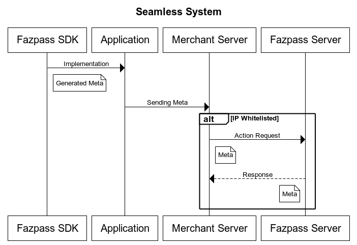

# Seamless

## Content
- [Preparation](#Preparation)
- [What's Meta](#Meta)


## Introduction


## Preparation
### Choose your stack technology and install it.

| No | Stack Technology | Link 		                                                                  |
| -- | --	 			|--------------------------------------------------------------------------|
| 1  | Android Native  	| [Link](https://github.com/fazpass-sdk/android-trusted-device-v2)  		     |
| 2  | IOS Native		| [Link](https://github.com/fazpass-sdk/ios-trusted-device-v2)  			        |
| 3  | Flutter			| [Link](https://github.com/fazpass-sdk/flutter-trusted-device-v2)  		     |
| 4  | React Native		| [Link](https://github.com/fazpass-sdk/react-native-trusted-device-v2)  	 |
| 5  | Web Browser		| [Web Browser](#web-browser)|                                             |                                                                      |

This sdk will generate META that will be used in the next step. As looked in the chart.

### Whitelist IP
Whitelist IP is used to secure your API from unauthorized access. You can whitelist your IP in [here](https://fazpass.com).

### Endpoint Request Body
BASE URL IS : https://api.fazpass.com
#### Check
URL: /v2/trusted-device/check

Check device status & user
```JSON
"pic_id":"anvarisy@gmail.com/62851++++",
"meta":"encrypted"
"merchant_app_id":"7a8s7sadad7a7gas77das7899089as8dasd"
```

#### Enroll
URL: /v2/trusted-device/enroll

Registering user and device as an authenticated user
```JSON
"pic_id":"anvarisy@gmail.com/62851++++",
"meta":"encrypted",
"merchant_app_id":"com.tokopedia.tkpd",
"challenge":"id"
```

#### Validate
/v2/trusted-device/validate

Validating user and device, this will return score and confidence level of security level.
```JSON
"fazpass_id":"fazpass_id",
"meta":"encrypted",
"merchant_app_id":"com.tokopedia.tkpd",
"challenge":"id"
```

#### Remove
/v2/trusted-device/remove

Remove this user & device from authenticated user
```JSON
"fazpass_id":"fazpass_id",
"meta":"encrypted",
"merchant_app_id":"com.tokopedia.tkpd",
"challenge":"id"
```

#### Send Notification
/v2/trusted-device/send/notification

Send notification into connected device that already trusted
```JSON

"pic_id":"",
"merchant_app_id":"7a8s7sadad7a7gas77das7899089as8dasd",
"meta":"",
"selected_device":"device_id"
```

#### Validate Notification

/v2/trusted-device/validate/notification

Verify if the received notification is valid or not, this will auto enroll user that request send notification.
```JSON

"notification_id":"",
"merchant_app_id":"7a8s7sadad7a7gas77das7899089as8dasd",
"meta":"",
"result":true/false

```

### Handle Response
After you call the API, you will get the response. This should like this
```JSON
"status":true,
"code":200
"data":{
  "meta":""
}
```

## Meta
Meta is an object that contains information about the user's device.
```JSON
{
  "challenge":"UUID"
  "fazpass_id":"fazpass_id",
  "scoring":90.0,
  "risk_level":"HIGH/LOW",
  "is_active":true/false,
  "time_stamp":"353666389900000",
  "platform":"android/ios",
  "is_rooted":true/false,
  "is_emulator":true/false,
  "is_gps_spoof":true/false,
  "is_app_tempering":true/false,
  "is_vpn":true/false,
  "is_clone_app":true/false,
  "is_screen_sharing":true/false,
  "is_debug":true/false,
  "application":"com.tokopedia.marketplace",
  "device_id":{"name":"Samsung",
                "os_version":"Q",
                "series":"A30",
                "cpu":"Mediatek"
              },
  "sim_serial":["abcde12345","zyxwv9875"],
  "sim_operator":["indosat","tsel"],
  "geolocation":{"lat":"2.90887363",
                 "lng":"4.9099876",
                  "distance":"8.4",
                 "time":"30000"},
  "client_ip":"127.0.0.1",
  "notifiable_devices":[
                         {"name":"Samsung",
                         "os_version":"Q",
                         "series":"A30",
                         "cpu":"Mediatek",
                          "id":"uuid"
                           },
                          {"name":"Samsung",
                          "os_version":"Q",
                          "series":"A50",
                          "cpu":"Helios"
                           "id":"uuid"
                            }
                        ],
  "biometric":{
              "level":"LOW/HIGH",
               "is_changed":false/true
              },
"enrolled_devices": [
                {
                    "id": "c519a31b-839f-4e33-9bfc-5b64fe38593f",
                    "name": "vivo",
                    "os_version": "Android 27",
                    "series": "vivo 1816",
                    "cpu": "MT6762V/WR",
                    "EnrolleDate": "2024-01-01T05:14:38.606Z"
                }
            ]
}
```
All you need is here. You can use this meta to create your own logic to secure your application.
### 1. Fazpass ID
Fazpass ID is a unique ID that is generated by Fazpass. This ID is used to identify the user's device.
### 2. Scoring
Scoring is a value that is generated by Fazpass. This value is used to determine the risk level of the user's device.
### 3. Risk Level
Risk level is a value that is generated by Fazpass. This value is used to determine the risk level of the user's device.
### 4. Is Active
This is status of fazpass id. If the status is false, it means that the fazpass id is not active.
### 5. Time Stamp
This is the time when the request transaction is created.
### 6. Platform
This is the platform of the user's device.
### 7. Is Rooted
This is the status of the user's device. If the status is true, it means that the user's device is rooted.
### 8. Is Emulator
This is the status of the user's device. If the status is true, it means that the user's device is emulator.
### 9. Is GPS Spoof
This is the status of the user's device. If the status is true, it means that the user's device is using GPS Spoof.
### 10. Is App Tempering
This is the status of the user's device. If the status is true, it means that the user's device is using App Tempering.
### 11. Is VPN
This is the status of the user's device. If the status is true, it means that the user's device is using VPN.
### 12. Is Clone App
This is the status of the user's device. If the status is true, it means that the user's device is using Clone App.
### 13. Is Screen Sharing
This is the status of the user's device. If the status is true, it means that the user's device is using Screen Sharing.
### 14. Is Debug
This is the status of the user's device. If the status is true, it means that the user's device is using Debug.
### 15. Application
This is the application that is installed in the user's device.
### 16. Device ID
This is the device ID of the user's device.
### 17. Sim Serial
This is the sim serial of the user's device.
### 18. Sim Operator
This is the sim operator of the user's device.
### 19. Geolocation
This is the geolocation of the user's device.
### 20. Client IP
This is the client IP of the user's device.
### 21. Challenge
This is unique ID that will be used to enroll, validate & remove. this only active for 90 sec after check request
### 22. Notifiable Device
List of connected device that was used by this account
### 23. Biometric
Biometric level that was used by user inside the device
### 24. Enrolled Device
List of device that already enrolled by that pic id

## Handle Error
| Error Name              | Combined Code | Explanation                                                  |
|-------------------------|---------------|--------------------------------------------------------------|
| ErrGeneral              | 50000         | General error with HTTP 500 Internal Server Error code.      |
| ErrInvalidToken         | 50012         | Token is invalid with HTTP 500 code.                         |
| ErrExpiredToken         | 50013         | Token is expired with HTTP 500 code.                         |
| ErrInvalidMerchantId    | 50014         | Invalid merchant ID with HTTP 500 code.                      |
| ErrGatewayDoesNotExists | 40001         | Gateway does not exist with HTTP 400 Bad Request code.       |
| ErrInvalidOtp           | 40002         | OTP is not valid with HTTP 400 code.                         |
| ErrInvalidRequest       | 40003         | Invalid request with HTTP 400 code.                          |
| ErrMerhantAppNotFound   | 40404         | Merchant app not found with HTTP 404 Not Found code.         |
| ErrInvalidKey           | 40005         | Invalid key with HTTP 400 code.                              |
| ErrMerchantRule         | 40006         | Rule not set with HTTP 400 code.                             |
| ErrStoreEndUser         | 50007         | End user failed to save with HTTP 500 code.                  |
| ErrStoreDevice          | 50008         | Device failed to save with HTTP 500 code.                    |
| ErrStoreUserApp         | 50009         | User app failed to save with HTTP 500 code.                  |
| ErrLogActivity          | 50010         | Log activity failed to save with HTTP 500 code.              |
| ErrUpdateUserApp        | 50011         | Update user app failed with HTTP 500 code.                   |
| ErrSaveKey              | 50015         | Save key failed with HTTP 500 code.                          |
| ErrStoreMerchantApp     | 50016         | Store merchant app failed with HTTP 500 code.                |
| ErrFazpassIdNotFound    | 40417         | Fazpass ID not found with HTTP 404 code.                     |
| ErrFazpassIdNotActive   | 40018         | Fazpass ID not active with HTTP 400 code.                    |
| ErrStorMerchantRule     | 50019         | Store merchant rule failed with HTTP 500 code.               |
| ErrEcrypte              | 50020         | Error in encryption with HTTP 500 code.                      |
| ErrDecprypte            | 50021         | Error in decryption with HTTP 500 code.                      |
| ErrKeyNotExist          | 50022         | Key does not exist with HTTP 500 code.                       |
| ErrGetAllMercahntApp    | 50023         | Error getting all merchant app with HTTP 500 code.           |
| ErrStatusMerchantApp    | 50024         | Invalid status of merchant app with HTTP 500 code.           |
| ErrGetAllLoActivityEndUser | 50025      | Error getting all activity by user with HTTP 500 code.       |
| ErrUpdateMerchantApp    | 50026         | Update merchant app failed with HTTP 500 code.               |
| ErrRevokeDeviceUser     | 50027         | Error revoke device user with HTTP 500 code.                 |
| ErrPackageIsExist       | 40028         | Package already exists with HTTP 400 code.                   |
| ErrWhiteListIp          | 40029         | IP not registered with HTTP 400 code.                        |
| ErrFcmToken             | 40030         | FCM token update failed with HTTP 400 code.                  |
| ErrNotifiableNotRegister| 40031         | Device cannot send notification with HTTP 400 code.          |
| ErrDeviceNotFound       | 40032         | Device not found with HTTP 400 code.                         |
| ErrDeviceNotFoundNotregister | 40033     | Device not found or app not registered with HTTP 400 code.   |
| ErrSendNotification     | 40034         | Error sending notification with HTTP 400 code.               |
| ErrValidationExpired    | 40035         | Validation notification expired with HTTP 400 code.          |
| ErrAlreadyValidation    | 40036         | Validation already done with HTTP 400 code.                  |
| ErrValidationNo         | 40037         | Validation response no with HTTP 400 code.                   |
| ErrFileAuthFormatMustBeP8 | 40038        | File auth format must be .p8 with HTTP 400 code.             |
| ErrUploadFileAuthKey    | 40039         | Upload file auth key failed with

## Web Browser
### Installation

Load the script in your html like this:

```html
<script src="http://seamless-web-notification.fazpass.com/bundle.js" defer onload="onloadFazpass()"></script>

<script>
    function onloadFazpass() {
        // get fazpass instance after script has been loaded
        let fazpass = window.Fazpass;
    }
</script>
```
### Getting Started

Before using this SDK, make sure to contact us first to get a public key.

This package main purpose is to generate meta which you can use to communicate with Fazpass rest API. But before calling generate meta method, you have to initialize it first by calling this method:

```js
fazpass.init(
    'YOUR_PUBLIC_KEY_FILE', 
    'YOUR_SERVICE_WORKER_FILE'
)
```

Then you have to ask user for notification permission. Note: you should spawn notifications in response to a user gesture.

```html
<!-- Copied examples from: https://developer.mozilla.org/en-US/docs/Web/API/Notification/requestPermission_static -->

<button onclick="askNotificationPermission()">Allow Notification</button>

<script>
    function askNotificationPermission() {
        if (!("Notification" in window)) {
            // Check if the browser supports notifications
            alert("This browser does not support desktop notification");
        } else if (Notification.permission === "granted") {
            // Check whether notification permissions have already been granted;
            // if so, create a notification
            const notification = new Notification("Hi there!");
            // …
        } else if (Notification.permission !== "denied") {
            // We need to ask the user for permission
            Notification.requestPermission().then((permission) => {
            // If the user accepts, let's create a notification
            if (permission === "granted") {
                const notification = new Notification("Hi there!");
                // …
            }
            });

            // At last, if the user has denied notifications, and you want to be respectful there is no need to bother them anymore.
        }
    }
</script>
```

#### Serving required files in your website

To initialize this SDK correctly, you have to serve these required files:

1. Your public key
2. Fazpass service worker

You can get the public key file by downloading it from your fazpass dashboard, then change it's extension from *.pub* to *.txt*. For the Fazpass service worker file, you can download it here: [Fazpass Service Worker]("") `TODO: Put the download link here`

Once you have obtained these required files, the easiest way to serve them is to put them in your static folder. Then `init()` method will look like this:

```js
// public key is served at https://www.yourdomain.com/files/public-key.txt
// fazpass service worker is served at https://www.yourdomain.com/sw/my-service-worker.js
fazpass.init(
    '/files/public-key.txt',
    '/sw/fazpass-service-worker.js'
)
```

### Usage

Call `generateMeta()` method to generate meta.

```js
// synchronous example
fazpass.generateMeta()
    .then((meta) => {
        console.log(meta)
    })
    .catch((err) => {
        if (err instanceof fazpass.UninitializedError) {
          console.error("UninitializedError: "+err.message)
        }
        if (err instanceof fazpass.PublicKeyNotExistError) {
          console.error("PublicKeyNotExistError: "+err.message)
        }
        if (err instanceof fazpass.EncryptionError) {
          console.error("EncryptionError: "+err.message)
        }
    })

// asynchronous example
try {
    let meta = await fazpass.generateMeta()
    console.log(meta)
} catch (err) {
    // handle on error...
}
```

### Errors

#### UninitializedError

Produced when fazpass init method hasn't been called once.

#### PublicKeyNotExistError

Produced when public key with the name registered in init method doesn't exist in the path.

#### EncryptionError

Produced when encryption went wrong because you used the wrong public key.

### Set preferences for data collection

This SDK supports application with multiple accounts, and each account can have different settings for generating meta.
To set preferences for data collection, call `setSettings()` method.

```js
// index of an account
let accountIndex = 0

// create preferences
let settings = {
    location: true
}

// save preferences
fazpass.setSettings(accountIndex, settings)

// apply saved preferences by using the same account index
fazpass.generateMeta(accountIndex)
    .then((meta) => {
        console.log(meta)
    })

// get saved preferences
let savedSettings = fazpass.getSettings(accountIndex)

// delete saved preferences
fazpass.setSettings(accountIndex)
```

`generateMeta()` accountIndex parameter has -1 as it's default value.

> We strongly advised against saving preferences into default account index. If your application
> only allows one active account, use 0 instead.

### Data Collection

Data collected and stored in generated meta. Based on how data is collected, data type is divided into two:
General data, Sensitive data.
General data is always collected while Sensitive data requires more complicated procedures before they can be collected.

To enable Sensitive data collection, you need to set preferences for them and specifies which sensitive data you want to collect.

```js
let settings = {
    location: true
}
```

Then, you have to follow the procedure on how to enable each of them as described in their own segment down below.

#### General data collected

* Your device platform name (Value will always be "web").
* Your website domain name (If your website is *<https://www.yourdomain.com>*, then *www.yourdomain.com* will be collected).
* Your browser integrity score.
* Your browser user agent.
* Your network IP Address.

#### Sensitive data collected

##### Your device location

After you enabled location data collection, `generateMeta()` will automatically ask user for location permission.

### Handle incoming Cross Device Request notification

When website tab is not active, incoming cross device request will enter your system notification tray and shows them as a notification. Pressing said notification will change your active tab into your website tab and send the data into the stream. When website tab is active, incoming cross device request will be sent into the stream without showing any notification.

To retrieve cross device request, you have to setup fazpass service worker as mentioned earlier in [Serving required files in your website](#serving-required-files-in-your-website). Then, you have to get the stream instance by calling `getCrossDeviceRequestStreamInstance()` and start listening to the stream.

```js
// get the stream instance and start listening to the stream
let requestStream = fazpass.getCrossDeviceRequestStreamInstance(
    (request) => {
      console.log(request)
    }
)

// stop listening to the stream
requestStream()
```
